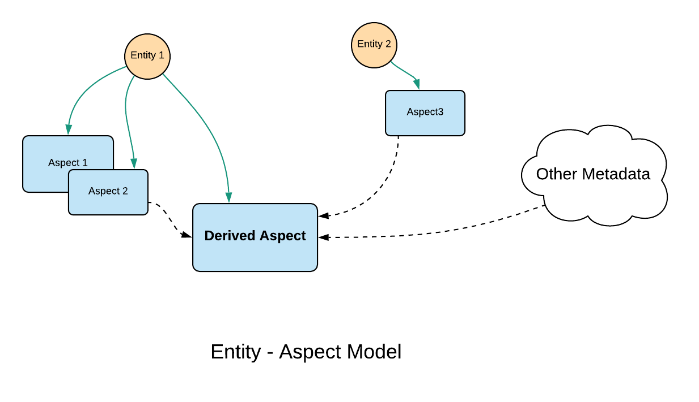
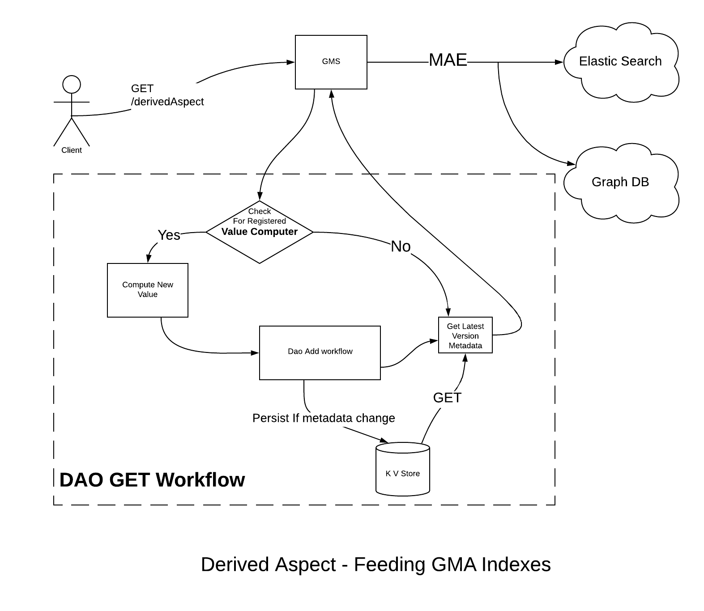
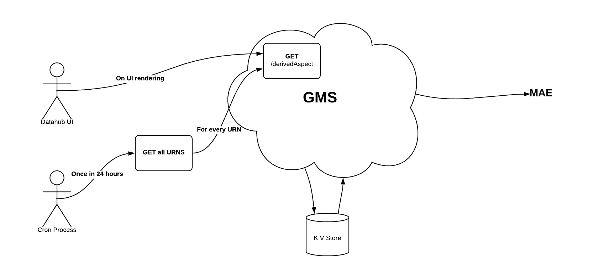

- Start Date: 2020-09-20
- RFC PR: #1882
- Discussion Issue: 
- Implementation PR(s):

# Derived Aspects

## Summary

Often we encounter a need to surface metadata by reading from multiple aspects of GMA, with or without any other auxiliary information. 

In a typical rest service, we expose this derived metadata by a resource action/method. This resource action/method does the heavy lifting of computing the derived information lazily. 

In the context of metadata, we might have needs to push this derived metadata into different indexes like search or graph.
In this feature we will discuss how we can enable search and discovery on the derived metadata. 

## Basic example

Metadata `Health` of a dataset is a typical example of this feature. The details of metadata `Health` will be covered in a separate RFC (the review of `Health` metadata is out of scope of this RFC)

To put it simple,  
- Health metadata is derived using metadata from multiple aspects.
- A need for promoting healthy datasets in search of the datasets.
- There are organizational needs to rollup unhealthy (or healthy) datasets to a ldap/manager/team. This has the needs to query graph in conjunction with health metadata.
    - Number of unhealthy datasets owned by me.
    - Number of unhealthy datasets owned by my organization.

## Motivation
In the context of derived metadata, we need the ability to 
1. Compute from different aspects
2. Maintain versions of the derived metadata 
3. Notify in the event of change in derived metadata
4. Search of entities powered with derived metadata
5. Graph query needs of entities powered with derived metadata.
6. Dump derived metadata along with regular aspects for offline consumption / analysis.

## Detailed design

Derived metadata can be modelled as an aspect of an entity. This is similar to any other aspect but with subtle differences.

- Value of this aspect gets computed only when `GET` API is invoked. 
- `GET` API computes, persists and retrieves the metadata from the KV store.

### Entity Aspect Model

Below shows a typical entity - aspect model for derived metadata. 


 
In the above, `DerivedAspect` is an aspect of entity1. The value of this is computed using metadata from 
- `aspect2` of `entity1`
- `aspect3` of `entity2`
- `other metadata` from auxiliary files / other services.

### Value Computers
Value computer classes computes the value of the derived aspects at that point of time by GMA DAOs.
- GMA DAO will have the provision to register value computers. Similar to how one registers the post update hooks in creation of DAO instance.
- GMA DAO on get of the aspect, will invoke the value computer, computes value, persists if necessary and returns the value.

### Annotating derived aspects
Derived aspects will be annotated in GMA using annotation `@gma.derivedaspect`. Refer below as an example

```pdl
@gma.derivedaspect
record FooDerivedAspect {
  barField : string
}
```
These annotations will by used `GMA DAO` to ensure there is only process of computing / persisting the derived aspetcs.
- derived aspects requires `ValueComputer` to be registered with DAO and will be validated
- get method of derived aspect always recomputes the value using `ValueComputer`
- add method of derived aspect will be blocked on the client provided value. It is always to be computed using `ValueComputer`.


```java
public <ASPECT extends RecordTemplate> ASPECT add(@Nonnull URN urn, @Nonnull ASPECT newValue,
      @Nonnull AuditStamp auditStamp) {
    // throw exception for derived aspect.
}
```

### Computation of Derived Aspect
 

`GET` API of a typical metadata aspect simply fetches latest value of the aspect from KV store.

Whereas, `GET` API for derived aspect, does something more than that. A typical workflow of `GET` of derived aspect is below.

#### Responsibility of Derived Aspect Resource
 
Registering a `ValueComputer` class with the DAO. (This is similar to registering post update hooks with DAO).

Every time `GET` is called on the derived aspect, `ValueComputer` would be invoked by GMA DAO to compute the current value of the derived value.

#### Responsibility of GMA DAO

#### Add
All client provided add calls for derived aspect will be blocked, or the value of derived aspect will always be changed to value provided by value computer.

#### Get
1. Invoke `ValueComputer` and compute the current value of the derived aspect.
2. Check if the derived metadata has changed from previous persisted value n KV store.
3. Persist if the metadata has changed.
4. Retrieve latest value of derived metadata and serve the `GET` request.

The persistence of the derived aspect follows GMA architecture. This helps with few of the motivational points mentioned.
1. Versioning capabilities of the derived metadata
2. Notification in the form of MAE when derived metadata has changed. With this, clients of this API need not ping GMS every other day to know if the compliance has changed.

The MAEs produced will further power both search and graph GMA indices. This is similar to any other GMA aspect.

If there is a process setup for dumping mysql store to analytical systems like HDFS, derived aspects also get naturally dumped along with other regular aspects.

### Refresh of derived aspect metadata
`GET` operation on derived aspect always gives the current state of derived metadata. 

Often, `GET` operation might not be called for all entity values. Hence, peeking into the DB doesn't guarantee to give the true state of derived aspect.
   
Depending on how fresh we need GMA indexes and how often we want to notify on the changes of derived aspect metadata, there is a need for a CRON job which calls GET operation for all URNs of the entity.  

 

In the above, a CRON job(or a regular backfill job) on a nightly basis calls `GET` API of derived aspect.
This ensures a few things
   - KV store is fresh after every 24 hours
   - Notification of change in derived metadata happens at-least once in 24 hours. 
       - Note that some other clients can call `GET` API with in 24 hours and there is a possibility of emitting MAE more than once in a day.

There might be cases derived aspects can be computed in realtime based on notifications (e.g., MAEs of different aspects).
In these cases, a CRON job is technically not necessary.
However, having a CRON job will ensure to have a process of maintaining freshness of the data even if a notification got missed while processing.

## How we teach this

- Derived metadata gets derived from multiple aspects of possibly different(or same) entities with(or without) any other auxiliary information.
- Derived metadata can be modelled as aspects and are called as `Derived Aspects`. These are very similar to any other GMA aspect.
- `GET` API of `Derived Aspect` always gives the up-to date derived metadata.
- `get` calls on DAOs are supported and `add` calls can be blocked. Clients will only declare computation method of the derived aspect as a `ValueComputer` class.
- A CRON job maintains the freshness of the `Derived Aspect` persisted in KV store and GMA indices.

## Drawbacks
As more and more derived aspects are on-boarded, additional load on the KV store is inevitable.

On the other hand, alternate design, doesn't persist the metadata in KV store. And would involve emitting MAEs on every GET call of derived aspect. This can be overwhelming on GMA indexes pipelines.

There is a tradeoff in choosing the KV store to persist more metadata for derived aspects, compared to overwhelming GMA indexing pipelines.

Given that we have horizontally scalable KV store solutions, I believe this should be of the least concern.
MySQL also seems to have a horizontally scalable solution (refer https://vitess.io/ )

## Alternatives

In the alternate design, we don't persist derived metadata in the KV store. The workflow looks like below. 

- `GET` API computes the current state of derived metadata. The computed value gets returned to the caller without persisting in KV store.
- `GET` API on derived aspect also emits MAE before returning to client. 
- Similar to the proposed design, a nightly CRON process always calls `GET` API for all entities. 

There are few major drawbacks in this approach and hence I am inclined to proposed design. 
1. Lots of MAEs are emitted. Hence, can potentially overwhelm GMA indexing pipelines. 
2. MAEs are emitted even when there is no change in metadata. This is a false positive. Clients can't rely on such notifications.
3. Versioning of derived metadata is not present and hence the state of derived metadata a few day back can't be answered.

## Rollout / Adoption Strategy
Existing users can start modelling derived metadata as derived aspects. Once they are modelled as aspects, naturally the benefits of GMA come for free. 

This should not cause any breaking changes.